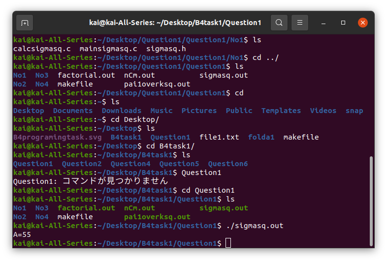
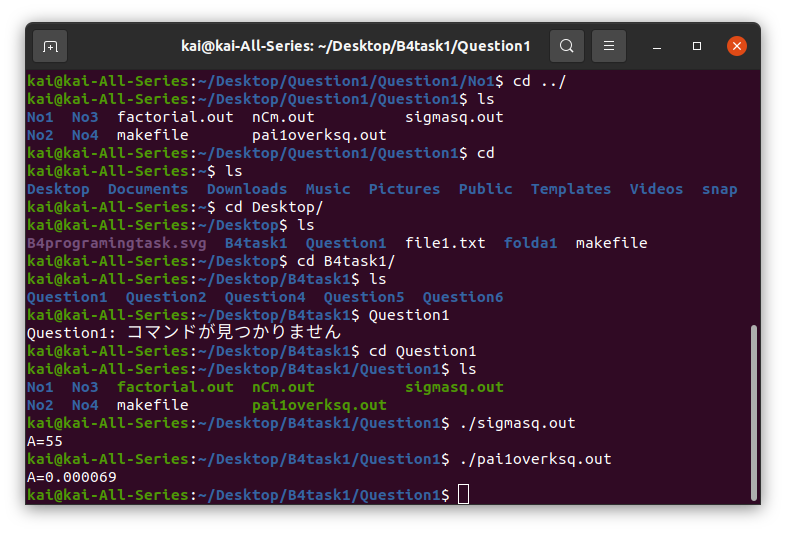
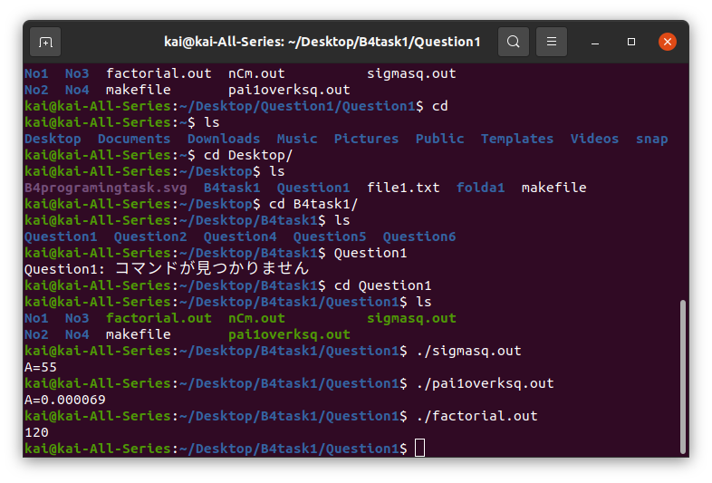
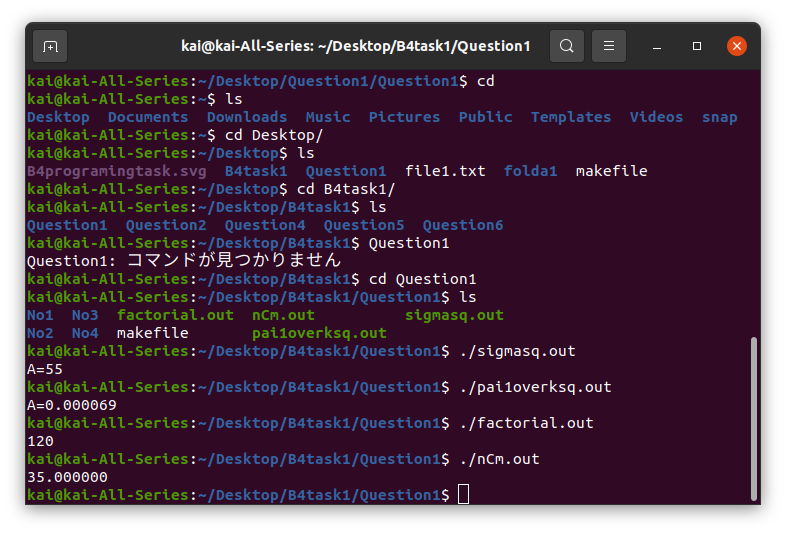

# 問1
##（１）
,,,
Bという変数（初期値0）に、for文を使ってk^2を足していった
,,,

##（2）
,,,
Bという変数（初期値1）に、for文を使って1/k^2をかけた
,,,

##（3）
,,,
Bという変数（初期値1）に、for文を使ってkをかけた
,,,

##（4）
,,,
nCmを計算するとき、m>nだと計算できないので、m>nだとエラーが出るようにmain文にプログラミングした。
また、計算は、nCm=n!/(n-m)!m! を使って計算している。４つの変数A,B,C,Dを用意し、Aにn!,Bに(n-m)!,Cにm!を代入して、D=A/B*Cを関数の戻り値としている。
,,,

